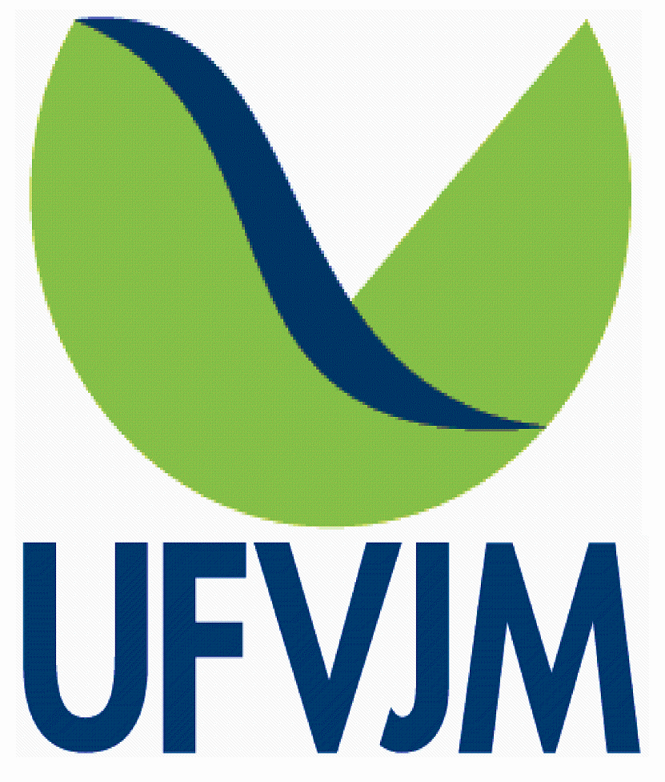

# App Inventário Nativas

Informações necessárias ao manejo e planejamento de povoamentos, que normalmente são referentes ao volume de madeira e/ou outra variável dendrométrica, no sentido qualitativo e quantitativo, são obtidas por meio do inventário florestal. Entretanto, o processamento dos mesmos geralmente é feito utilizando softwares pagos. Este app foi criado com o intuito de facilitar este processo, de forma prática e gratuita, sem a necessidade de se manipular planilhas ou instalar softwares. Utilizando a linguagem R em conjunto com o pacote Shiny, temos uma ferramenta poderosa, que pode ser utilizada direto do navegador, por profissionais da área, estudantes e entusiastas que desejam processar um inventário e realizar análises em florestas nativas, pelos métodos mais utilizados de análise fitossociológica, seleção, classificação e inventário.
Com este app, é possível realizar análises fitossociológicas, calcular índices de diversidade, entre outros, e o processamento de inventário florestal, utilizando os métodos: Amostragem Casual Simples, Amostragem Estratificada, e Amostragem Sistemática.

### Script criado por:

[Sollano Rabelo Braga](http://lattes.cnpq.br/7271838547135276 "Curriculum Lattes"), [Eric Bastos Gorgens](http://lattes.cnpq.br/2266409430041146 "Curriculum Lattes") &
[Marcio Leles R. de Oliveira](http://lattes.cnpq.br/1808132114787261 "Curriculum Lattes")

### Referências:

CAMPOS, J. C. C.; LEITE, H. G. Mensuração florestal: perguntas e respostas. 3ª. ed. Viçosa: Editora UFV, 2013. 605 p.

SOARES, C. P. B.; NETO, F. D. P.; SOUZA, A. L. D. Dendrometria e Inventário Florestal. 2ª. ed. Viçosa: UFV, 2012. 272 p.

SOUZA, A. L. D; SOARES, C. P. B. Florestas Nativas: estrutura, dinâmica e manejo. 1ª. ed. Viçosa: UFV, 2013. 322 p.

